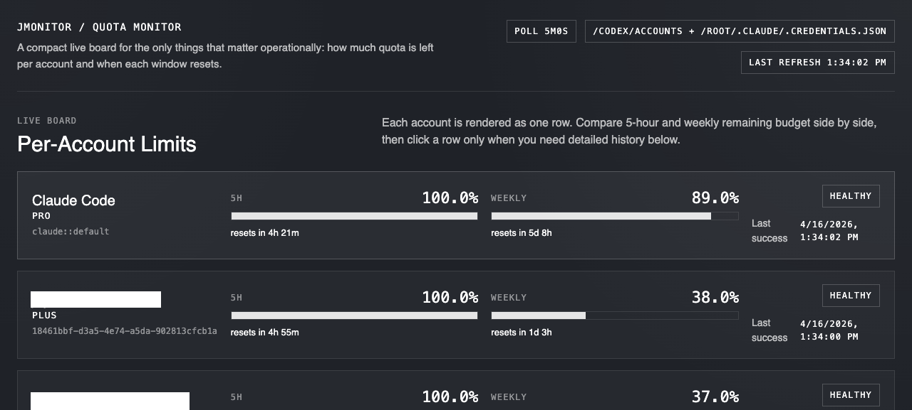

# jmonitor

V1 quota usage monitor for Codex and Claude Code.



Features:

- scans `CODEX_HOME/accounts/*.auth.json`
- scans `~/.claude/.credentials.json`
- polls Codex and Claude usage every 5 minutes
- stores 5-hour and weekly remaining percentages in PostgreSQL
- serves a local dashboard and JSON API

Docker Compose stack:

- `postgresdb`: local PostgreSQL
- `server`: poller + API/dashboard app
- `webserver`: nginx reverse proxy published to the host
- `cloudflared`: optional Cloudflare Tunnel sidecar for public HTTPS ingress

Environment:

- `DATABASE_URL`
- `CODEX_HOME` (optional, defaults to `~/.codex`)
- `HTTP_ADDR` (default `:8080`)
- `POLL_INTERVAL` (default `5m`)
- `CLAUDE_HOME_HOST` (Compose only, defaults to `~/.claude`)
- `CLAUDE_CREDENTIALS_JSON` (optional, lets Compose inject Claude credentials directly from the host)
- `WEB_PORT` (default `4748`)
- `APP_HOSTNAME` (for example `monitor.namjaeyoun.com`)
- `CLOUDFLARE_TUNNEL_TOKEN` (required only when starting the tunnel profile)

Run:

```bash
go run ./cmd/jmonitor
```

Run with Docker Compose:

```bash
cp .env.example .env
docker compose up --build
```

Notes:

- `server` reads Codex account snapshots from `/codex/accounts/*.auth.json`.
- `server` reads Claude Code credentials from `/root/.claude/.credentials.json` when available.
- `server` also reads `CLAUDE_CREDENTIALS_JSON` when you inject Claude credentials through the environment.
- In Compose, that path is backed by `${CODEX_HOME_HOST:-$HOME/.codex}` mounted read-only from the host.
- In Compose, Claude credentials are backed by `${CLAUDE_HOME_HOST:-$HOME/.claude}` mounted read-only from the host.
- `make publish` auto-loads Claude credentials from the macOS Keychain into `CLAUDE_CREDENTIALS_JSON` when `~/.claude/.credentials.json` does not exist.
- `.env` is optional. You only need `CODEX_HOME_HOST` or `CLAUDE_HOME_HOST` when your local paths differ from `~/.codex` and `~/.claude`.
- Open `http://localhost:4748` after the stack is healthy.

Cloudflare Tunnel deploy:

1. Create or reuse a named tunnel in Cloudflare Zero Trust.
2. Add a public hostname for `monitor.namjaeyoun.com` that points to `http://webserver:80`.
3. Copy the tunnel token into `.env` as `CLOUDFLARE_TUNNEL_TOKEN`.
4. Start the stack with the tunnel profile:

```bash
cp .env.example .env
make publish
```

Stop the published stack:

```bash
make unpublish
```

Notes for the tunnel setup:

- The `cloudflared` container waits for `webserver` health before connecting.
- `make publish` requires `.env` and refuses to run if `CLOUDFLARE_TUNNEL_TOKEN` is blank.
- `make unpublish` stops the compose stack and tunnel profile but leaves the PostgreSQL volume intact.
- `make publish` defaults `APP_HOSTNAME` to `monitor.namjaeyoun.com` unless you override it in your shell or `.env`.
- You can keep `WEB_PORT` published for local fallback access, or change it if `4748` is already in use.
- Public traffic should terminate at Cloudflare and then enter the internal Docker network through the tunnel.
- This repository does not provision the Cloudflare DNS/public hostname automatically; that mapping must exist in Cloudflare first.

Endpoints:

- `GET /`
- `GET /api/accounts`
- `GET /api/accounts/{id}/history?window=five_hour&limit=288`
- `GET /healthz`
